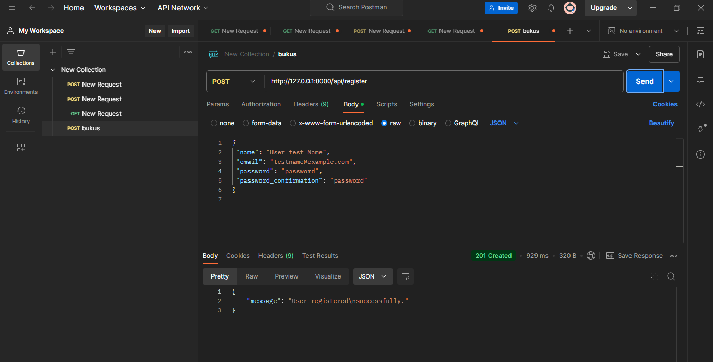
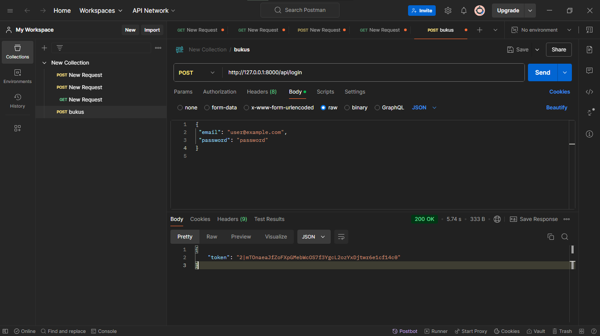
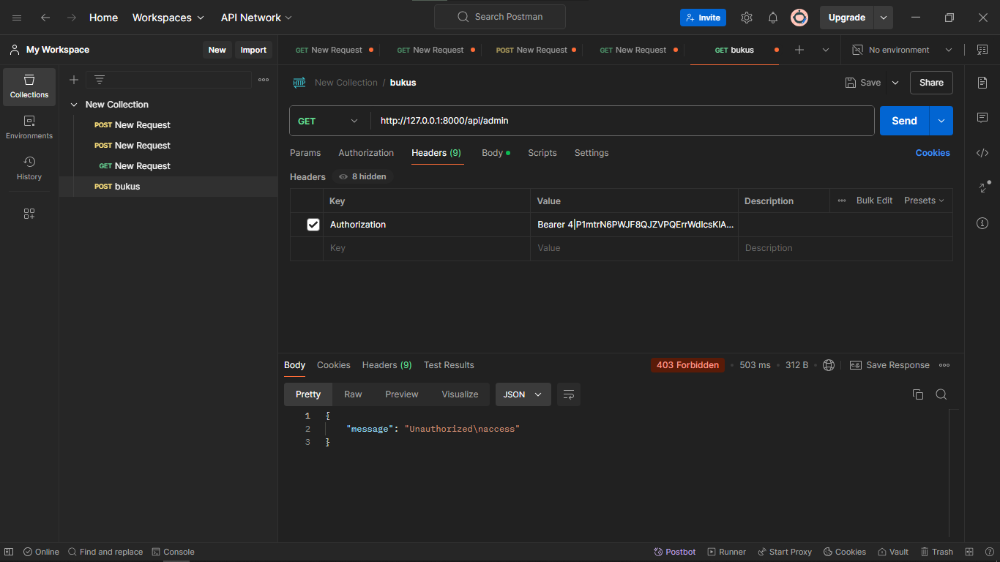
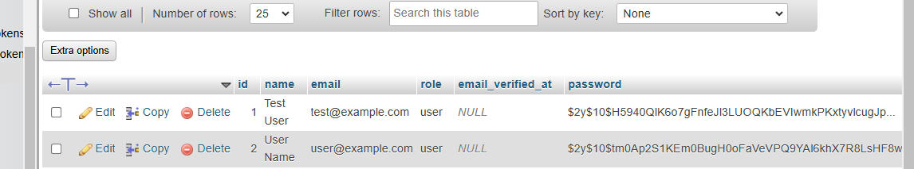

di atas merupakan hasil dar menciptakan user baru 

di atas adalah token yang telah di dapatkan setelh login

pada gambar di atas merupakan hasil dari memasukan token yang telah di dapatkan,
dan hasil nya adalah     "message": "Unauthorized\naccess" mungkin karena pada yang saya masukan 
pada di dalam postman itu role nya user seperti yang terlihat pada localhost php myadmin

seperti yang di lihat di atas role nya user

<h1> PRAKTIKUM </h1>

