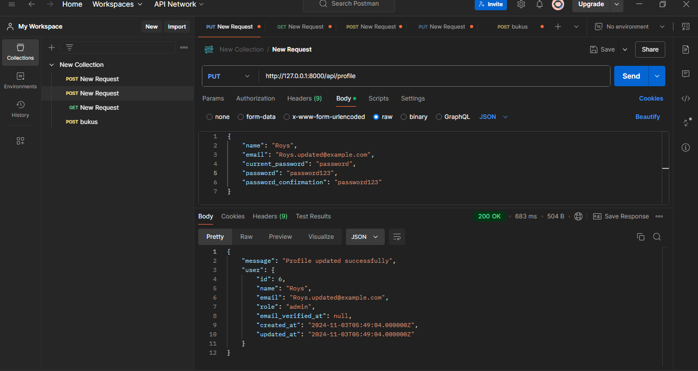
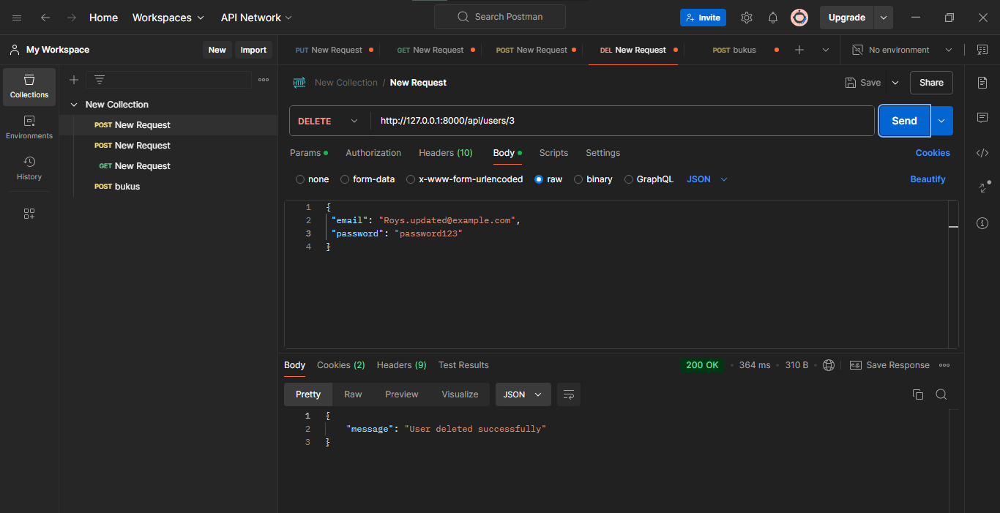

di atas merupakan hasil dar menciptakan user baru 

di atas adalah token yang telah di dapatkan setelh login

pada gambar di atas merupakan hasil dari memasukan token yang telah di dapatkan,
dan hasil nya adalah     "message": "Unauthorized\naccess" mungkin karena pada yang saya masukan 
pada di dalam postman itu role nya user seperti yang terlihat pada localhost php myadmin

seperti yang di lihat di atas role nya user

dan untuk membutikan nya saya mengubah sedikit coding nya supaya nanti bisa membedakan login user atau admin 
dan tercipta lah admin dan tabel pada mysql nya terdapat di bawah

<h1> PRAKTIKUM </h1>

PENGUBAHAN PROFILE ADMIN

sebelum

waktu di ubah

sesudah di ubah

code

route api

Implementasikan sistem untuk menghapus pengguna dengan otorisasi admin.

id yang dihapus

sebelum

sesudah

code nya

route api

Buat API untuk mengambil daftar semua pengguna (hanya bisa diakses oleh admin)

perubahan url untuk meng get semua users(menampilkan semua users)

code menampilkn semua users

route api select all
{
    "users": [
        {
            "id": 1,
            "name": "Test User",
            "email": "test@example.com",
            "role": "user",
            "email_verified_at": null,
            "created_at": "2024-11-01T03:44:32.000000Z",
            "updated_at": "2024-11-01T03:44:32.000000Z"
        },
        {
            "id": 4,
            "name": "Users Name",
            "email": "tesstname@example.com",
            "role": "user",
            "email_verified_at": null,
            "created_at": "2024-11-03T05:06:24.000000Z",
            "updated_at": "2024-11-03T05:06:24.000000Z"
        },
        {
            "id": 5,
            "name": "User Name",
            "email": "user@example.com",
            "role": "admin",
            "email_verified_at": null,
            "created_at": "2024-11-03T05:19:19.000000Z",
            "updated_at": "2024-11-03T05:19:19.000000Z"
        },
        {
            "id": 6,
            "name": "Roys",
            "email": "Roys.updated@example.com",
            "role": "admin",
            "email_verified_at": null,
            "created_at": "2024-11-03T05:49:04.000000Z",
            "updated_at": "2024-11-03T05:49:04.000000Z"
        }
    ]
}

<h3>hasil dari memanggil all users</h3>

